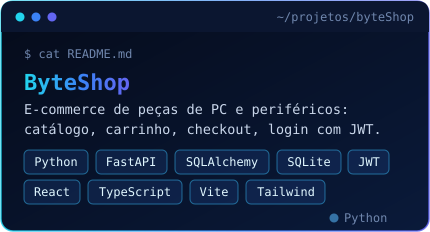
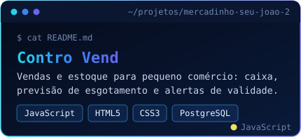
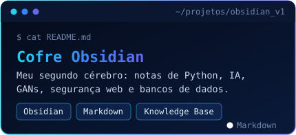
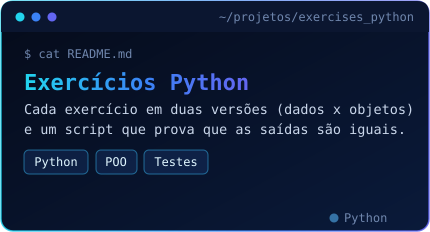

<p align="center">
  
</p>

<p align="center">
  <a href="https://github.com/Di20232">
    
  </a>
</p>

<p align="center">
  
  
  
</p>

<p align="center">
  <code>// supere quem você foi ontem</code>
</p>

<p align="center"></p>

<p align="center"></p>

<p align="center">
  
</p>

<p align="center"></p>

<p align="center"></p>

```text
foco/
├─ Desenvolvimento Full Stack
├─ Back-end com Python e PHP
├─ Front-end com HTML5, CSS3 e Vite
├─ Sistemas de Gestão (vendas, estoque, e-commerce)
├─ Bancos de Dados (PostgreSQL, MySQL, SQLite)
├─ Inteligência Artificial Aplicada
├─ Desenvolvimento com IA (Claude e ChatGPT)
├─ GANs e Dados Sintéticos
└─ Segurança Web
```

<p align="center"></p>

<p align="center"></p>

<p align="center">
  <br><br>
  <br>
  <sub><code>IA: Claude · ChatGPT · OpenRouter · OmniRoute · 9Router</code></sub>
</p>

<p align="center"></p>

<p align="center"></p>

<p align="center">
  <a href="https://github.com/Di20232/byteShop"></a>
  <a href="https://github.com/Di20232/mercadinho-seu-joao-2"></a>
  <a href="https://github.com/Di20232/obsidian_v1"></a>
  <a href="https://github.com/Di20232/exercises_python"></a>
</p>

<p align="center"></p>

<p align="center"></p>

<p align="center">
  
</p>

<p align="center"></p>

<p align="center"></p>

<p align="center">
  
</p>

<p align="center">
  
  
</p>

<p align="center"></p>

<p align="center"></p>

<p align="center">
  
</p>

<p align="center">
  
</p>

<p align="center">
  <code>// constância compõe com o tempo</code>
</p>

<p align="center"></p>

<p align="center"></p>

```text
em_estudo/
├─ Estruturas de Dados & Algoritmos
├─ Machine Learning com Python
├─ Redes Generativas (GANs)
├─ Arquitetura de Software
├─ Segurança de Aplicações Web
└─ Git, GitHub & Deploy na Nuvem
```

<p align="center"></p>

<p align="center"></p>

```text
Disciplina    >  Motivação
Execução      >  Desculpas
Constância    >  Intensidade
Conhecimento  >  Ego
Progresso     >  Perfeição
```

<p align="center">
  
</p>

<p align="center">
  
</p>
